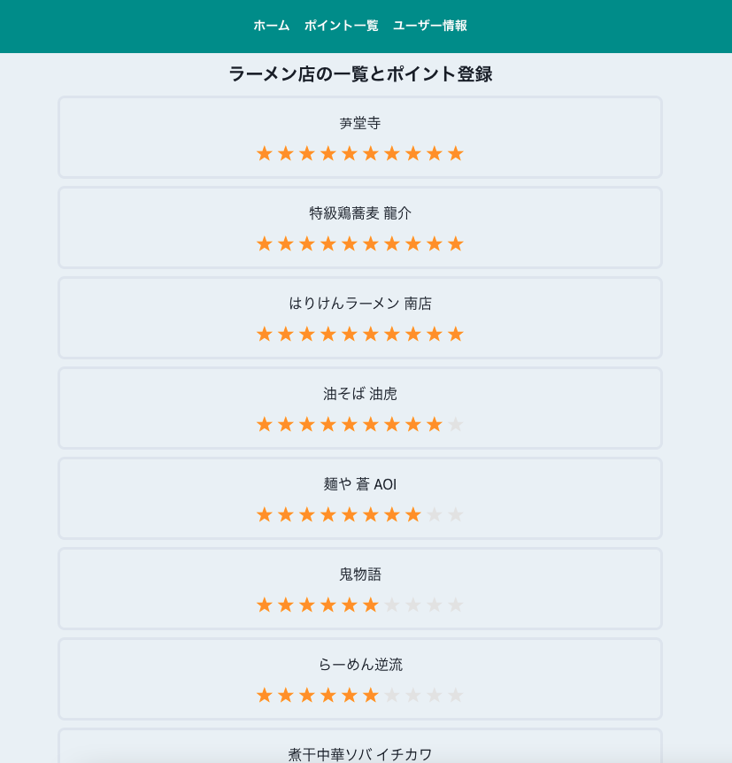
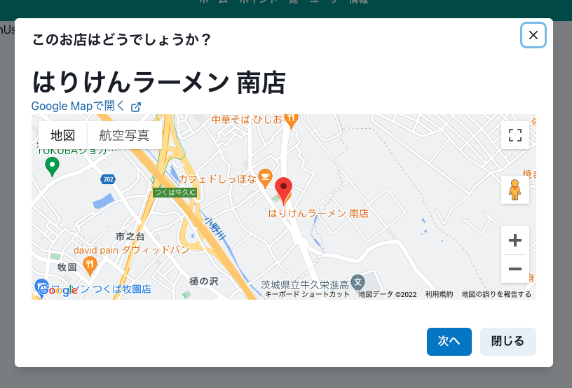
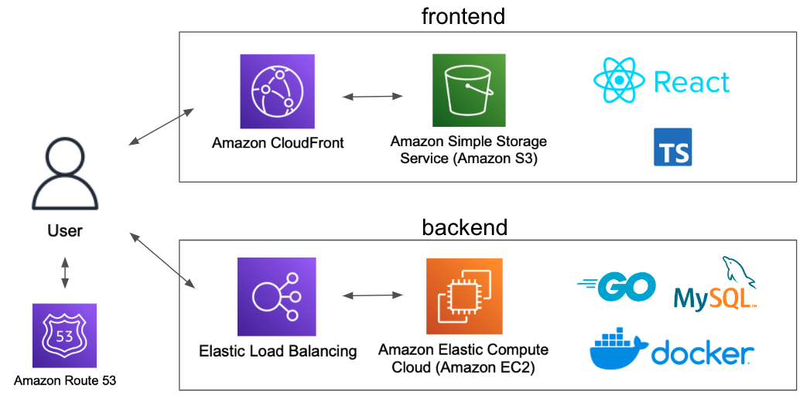

# つくば市周辺のラーメン店を紹介するアプリケーション

# URL

https://tsukuba-ramen-suggest.com/

# 機能紹介

### ラーメン店のポイントの記録

### ラーメン店の提案

登録したポイントを元にラーメン店を提案。登録のないお店については一定のポイントで計算。

# 開発環境・言語等

### [frontend](https://github.com/taigamur/ramen_suggestion_react)
React, TypeScript

### [backend](https://github.com/taigamur/ramen_suggestion_go)
Docker, Go

### dabase
Docker, MySQL